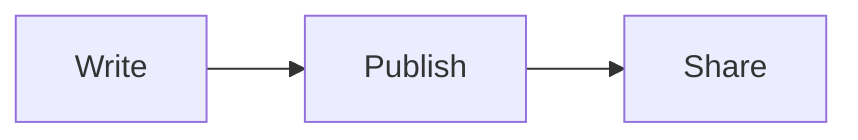

# Notelet / 短笺

[简体中文](README.zh-CN.md) · [Live site](https://notelet.youcaidi.link) · [Contributing](CONTRIBUTING.md)

Notelet is a minimal, Telegra.ph-inspired service for sharing Markdown documents and Codex conversations. Its English name means “a little or short note,” directly reflecting the Chinese name 短笺. It runs entirely on Cloudflare Workers, KV, and R2, and supports English and Simplified Chinese.

## Features

- Notion-style visual Markdown editing with source mode
- Headings, lists, tasks, quotes, code blocks, tables, and pasted images
- Syntax highlighting for common programming languages and Mermaid diagrams
- Collapsible table of contents while editing and reading
- Structured Codex conversation pages with per-turn Markdown and image support
- Random or custom short links with configurable TTL
- Raw Markdown or conversation JSON downloads
- Anonymous publishing protected by Cloudflare rate limiting
- Safe Markdown rendering with raw HTML disabled
- English and Simplified Chinese UI
- A public `/status` page with share totals, R2 storage, and optional free-tier operation usage

## Architecture

```text
Browser (Vite app)
   │
   ▼
Cloudflare Worker ── Workers KV (documents and conversations)
   │
   └─────────────── R2 (images)
```

The repository is deliberately small:

- `public/` — browser UI, editor, reader, styles, and translations
- `src/` — Worker routes, Markdown rendering, and conversation normalization
- `test/` — Vitest tests and fixtures
- `docs/` — architecture and deployment notes

See [Architecture](docs/ARCHITECTURE.md) for data flow and security boundaries.

## Requirements

- Node.js 20 or newer
- A Cloudflare account with Workers, KV, and R2
- Wrangler authentication for deployment

## Local development

```bash
npm install
cp .dev.vars.example .dev.vars
npm run dev
```

Open the URL printed by Wrangler. Local development uses the bindings declared in `wrangler.jsonc`; replace the production identifiers before deploying your own instance.

## Cloudflare setup

1. Authenticate and create the storage resources:

   ```bash
   npx wrangler login
   npx wrangler kv namespace create DOCS
   npx wrangler r2 bucket create duanjian-images
   ```

2. Put the returned KV namespace ID, your R2 bucket name, and your custom domain in `wrangler.jsonc`.
3. Deploy:

   ```bash
   npm run deploy
   ```

4. Add the custom domain in Cloudflare Workers & Pages if it is not managed through the route in `wrangler.jsonc`.

Detailed instructions are in [Deployment](docs/DEPLOYMENT.md).

## Useful commands

```bash
npm run dev       # build and start a local Worker
npm test          # run unit tests
npm run check     # TypeScript type check
npm run build     # production browser bundle
npm run validate  # run all project checks
npm run deploy    # build and deploy with Wrangler
```

## API overview

| Route | Purpose |
| --- | --- |
| `POST /api/docs` | Publish a Markdown document |
| `GET /api/docs/:slug` | Retrieve document metadata and content |
| `GET /api/docs/:slug/raw` | Download original Markdown |
| `POST /api/conversations` | Publish a structured conversation |
| `GET /api/conversations/:slug` | Retrieve a conversation |
| `GET /api/conversations/:slug/raw` | Download conversation JSON |
| `POST /api/images` | Upload an image |
| `GET /i/:key` | Retrieve an image from R2 |
| `POST /api/preview` | Render a safe Markdown preview |
| `GET /api/status` | Retrieve aggregated, content-free service statistics |

The reader recognizes fenced code languages such as `javascript`, `typescript`, `python`, `go`, `rust`, `java`, `bash`, `json`, `sql`, and CSS/HTML. A `mermaid` fence renders supported Mermaid diagrams in strict security mode:

````markdown

````

The status page always counts documents, conversations, R2 objects, and R2 bytes directly. To display Workers, KV, and R2 operation usage, configure `CLOUDFLARE_ACCOUNT_ID` and the secret `CLOUDFLARE_ANALYTICS_TOKEN` with read-only Account Analytics permission. Never commit the token.

Expired shares return `410 Gone`. The Worker checks `expiresAt` on every read, while KV expiration and a daily R2 cleanup job perform eventual physical deletion.

## Privacy and security

Publishing is anonymous, so a public instance should keep Cloudflare rate limiting enabled. Notelet stores only visible user content, assistant answers, visible progress, and readable reasoning summaries. It does not export hidden chain-of-thought, system instructions, credentials, or raw tool payloads.

Never commit `.dev.vars` or credentials. See [Security](SECURITY.md) for reporting instructions.

## Contributing

Issues and pull requests are welcome. Please read [CONTRIBUTING.md](CONTRIBUTING.md) before submitting changes.

## License

[MIT](LICENSE) © 2026 lixwen
