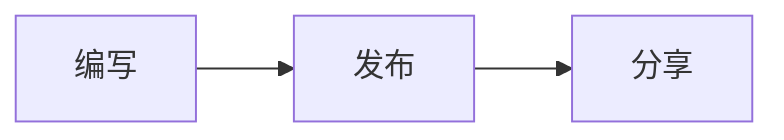

# 短笺 / Notelet

[English](README.md) · [在线站点](https://notelet.youcaidi.link) · [参与贡献](CONTRIBUTING.md)

短笺（英文名 Notelet）是一个受 Telegra.ph 启发的极简 Markdown 文档与 Codex 会话分享服务。Notelet 在英文中意为“小笺、简短便笺”，与中文名称直接对应。项目完全运行在 Cloudflare Workers、KV 和 R2 上，界面支持简体中文与英文。

## 功能

- 类 Notion 的可视化 Markdown 编辑器，并可切换源码模式
- 支持标题、列表、任务、引用、代码块、表格以及直接粘贴图片
- 常见编程语言代码高亮，并支持 Mermaid 图表
- 编辑和阅读时均可使用可收起目录
- 以独立消息块展示 Codex 会话，保留每轮 Markdown 和图片
- 支持随机或自定义短链，并可配置有效期
- 下载原始 Markdown 或会话 JSON
- 匿名发布，并使用 Cloudflare Rate Limiting 防止滥用
- 禁用原始 HTML，安全渲染 Markdown
- 简体中文和英文界面
- `/status` 状态页展示分享数量、R2 存储和可选的免费额度操作用量

## 架构

```text
浏览器（Vite 应用）
   │
   ▼
Cloudflare Worker ── Workers KV（文档与会话）
   │
   └─────────────── R2（图片）
```

项目目录保持简单：

- `public/`：浏览器界面、编辑器、阅读页、样式和翻译
- `src/`：Worker 路由、Markdown 渲染与会话规范化
- `test/`：Vitest 测试和样例数据
- `docs/`：架构与部署说明

更多细节见[架构说明](docs/ARCHITECTURE.md)。

## 环境要求

- Node.js 20 或更高版本
- 开通 Workers、KV 和 R2 的 Cloudflare 账户
- 部署时需要登录 Wrangler

## 本地开发

```bash
npm install
cp .dev.vars.example .dev.vars
npm run dev
```

打开 Wrangler 输出的本地地址。开发环境使用 `wrangler.jsonc` 中声明的绑定；部署自己的实例前，请替换其中的生产资源标识。

## Cloudflare 部署

1. 登录并创建存储资源：

   ```bash
   npx wrangler login
   npx wrangler kv namespace create DOCS
   npx wrangler r2 bucket create duanjian-images
   ```

2. 将返回的 KV namespace ID、R2 bucket 名称和自定义域名写入 `wrangler.jsonc`。
3. 执行部署：

   ```bash
   npm run deploy
   ```

4. 如果自定义域名没有通过 `wrangler.jsonc` 的 route 管理，请在 Cloudflare Workers & Pages 中添加。

完整步骤见[部署说明](docs/DEPLOYMENT.md)。

## 常用命令

```bash
npm run dev       # 构建并启动本地 Worker
npm test          # 运行单元测试
npm run check     # TypeScript 类型检查
npm run build     # 构建生产版前端
npm run validate  # 执行所有项目检查
npm run deploy    # 使用 Wrangler 构建并部署
```

## API 概览

| 路由 | 用途 |
| --- | --- |
| `POST /api/docs` | 发布 Markdown 文档 |
| `GET /api/docs/:slug` | 获取文档元数据和内容 |
| `GET /api/docs/:slug/raw` | 下载原始 Markdown |
| `POST /api/conversations` | 发布结构化会话 |
| `GET /api/conversations/:slug` | 获取会话 |
| `GET /api/conversations/:slug/raw` | 下载会话 JSON |
| `POST /api/images` | 上传图片 |
| `GET /i/:key` | 从 R2 获取图片 |
| `POST /api/preview` | 安全预览 Markdown |
| `GET /api/status` | 获取不包含内容的聚合服务状态 |

阅读页可识别 `javascript`、`typescript`、`python`、`go`、`rust`、`java`、`bash`、`json`、`sql`、CSS/HTML 等常见代码围栏。将围栏语言写为 `mermaid`，即可在严格安全模式下渲染 Mermaid 图表：

````markdown

````

状态页始终直接统计文档、会话、R2 对象数和 R2 体积。如需显示 Workers、KV 和 R2 操作次数，请配置 `CLOUDFLARE_ACCOUNT_ID`，并以 secret 方式设置具备 Account Analytics 只读权限的 `CLOUDFLARE_ANALYTICS_TOKEN`。不得将 token 提交到仓库。

过期内容返回 `410 Gone`。Worker 会在每次读取时检查 `expiresAt`，KV 过期机制和每日 R2 清理任务负责最终物理删除。

## 隐私与安全

发布无需登录，因此公开部署时应保留 Cloudflare Rate Limiting。短笺只保存可见的用户内容、助手回答、可见执行过程和可读的思考摘要，不导出隐藏思维链、系统指令、凭据或原始工具载荷。

不要提交 `.dev.vars` 或任何凭据。安全问题报告方式见 [SECURITY.md](SECURITY.md)。

## 参与贡献

欢迎提交 Issue 和 Pull Request。开始前请阅读 [CONTRIBUTING.md](CONTRIBUTING.md)。

## 开源协议

[MIT](LICENSE) © 2026 lixwen
